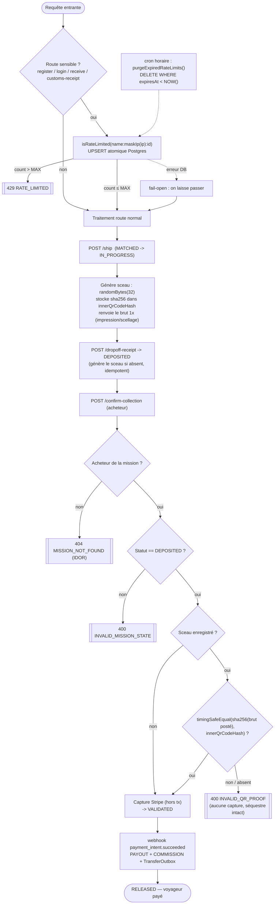
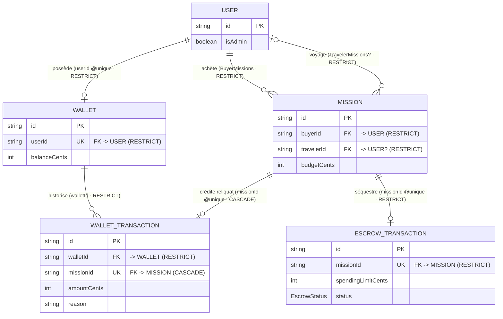

# Flux de sécurité global — Rate-limiter + validation QR

Deux contrôles indépendants :
1. **Rate-limiter distribué** — en bordure des routes sensibles (auth + actions mission), avant tout traitement.
2. **Sceau QR interne** — au point de libération du séquestre (`/confirm-collection`).

## Lecture rapide
- Le rate-limiter et le sceau QR sont **orthogonaux** : le premier protège l'accès (brute-force, flood), le second protège la **libération des fonds** (anti colis vide).
- Aucune capture Stripe n'a lieu tant que la preuve QR n'est pas validée (quand un sceau existe).
- Le rate-limiter est **fail-open** ; le sceau QR est **fail-closed** (pas de preuve ⇒ pas de libération).

## Modèle de données — Wallet ↔ Mission ↔ User

Autorisation par ressource : « acheteur » / « voyageur » est dérivé des FK
`Mission.buyerId` / `Mission.travelerId` (pas de rôle de compte). Les FK en
`RESTRICT` (sans cascade) dictent l'ordre de purge des tests : il faut détruire
`WalletTransaction → Wallet → User` et `EscrowTransaction → Mission → User`
(cf. `tests/helpers/db-reset.ts`).

- Un `User` a **0..1** `Wallet` (`userId @unique`) ; le `Wallet` est **RESTRICT** sur l'utilisateur ⇒ purge avant `user.deleteMany()`.
- Un `WalletTransaction` est **unique par mission** (idempotence du crédit résiduel de substitution) et **cascade** avec la mission, mais reste **RESTRICT** sur le wallet.
- L'`EscrowTransaction` (1:1 mission) est **RESTRICT** ⇒ purge avant la mission.
